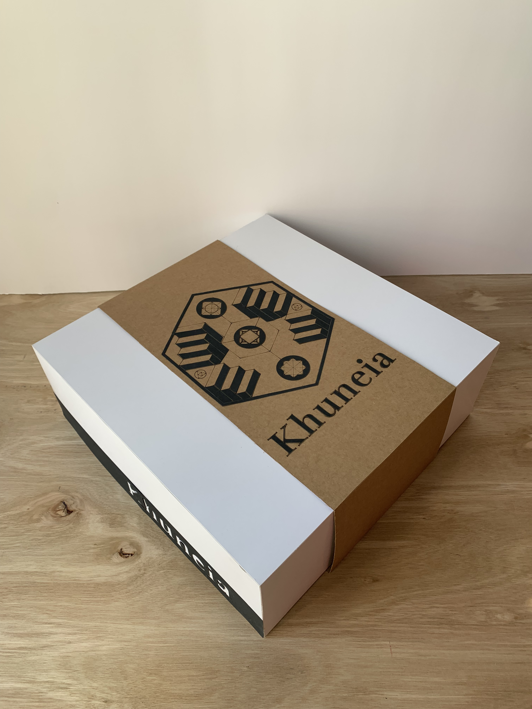
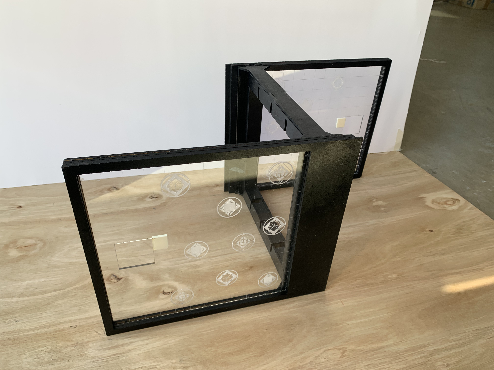

# Khuneia 

 

 
 

En este repositorio se encuentran todos los archivos de corte láser e impresión 3d que permiten la reproducción del juego de mesa Khuneia, realizado como proyecto final para el Taller de Diseño de Interacción 2022 por Luciana Jorquera, Paulina Zúñiga, Martina Vásquez, Maite Aranda y Javiera Ruiz. 

## Descripción general del proyecto
Khuneia es un juego de estrategia en el cual, mediante la construcción de un camino de escaleras, debes avanzar por el tablero hasta la salida de este y obtener la piedra filosofal. En este recorrido dos alquimistas compiten por alcanzar el máximo tesoro, la piedra filosofal, que otorga a quien la alcance un poder incomparable. 

A continuación puedes descargar las instrucciones del juego:

[Instructivo Khuneia PDF](imagenes/instructivo%20khuneia.pdf)

## Herramientas y Tecnologías Utilizadas
En este proyecto se utilizaron diferentes tipos de tecnologías relacionadas a la construcción del juego. Se utilizó la cortadora láser para obtener una mayor precisión y velocidad de producción en el corte de piezas estructurales del juego como por ejemplo, el tablero. Por otro lado, se utilizó una impresora 3d para realizar piezas claves del juego como lo son las escaleras y los peones. 

## Estructura de Carpetas del repositorio

### Impresión 3d

[Archivos de impresión 3d](https://javieraruizm.github.io/khuneia-tdix/impresion-3d)

### Corte láser

[Archivos de corte láser](https://javieraruizm.github.io/khuneia-tdix/corte-laser)

## Galería de Imágenes

 

 

