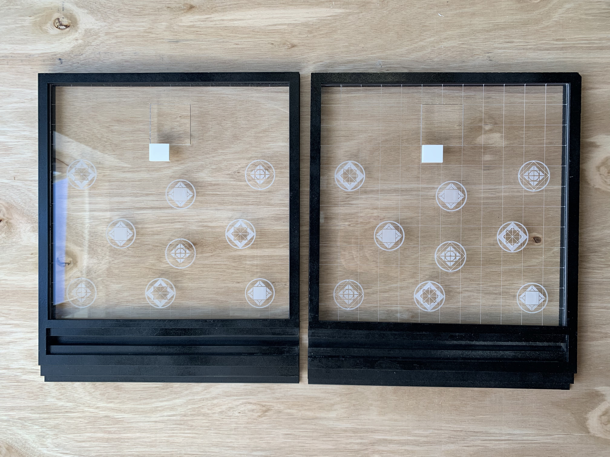
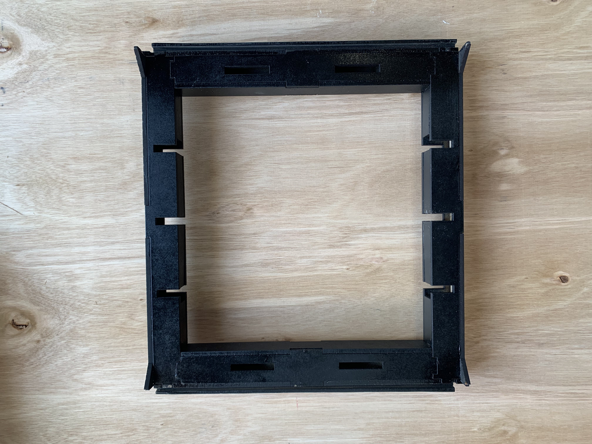
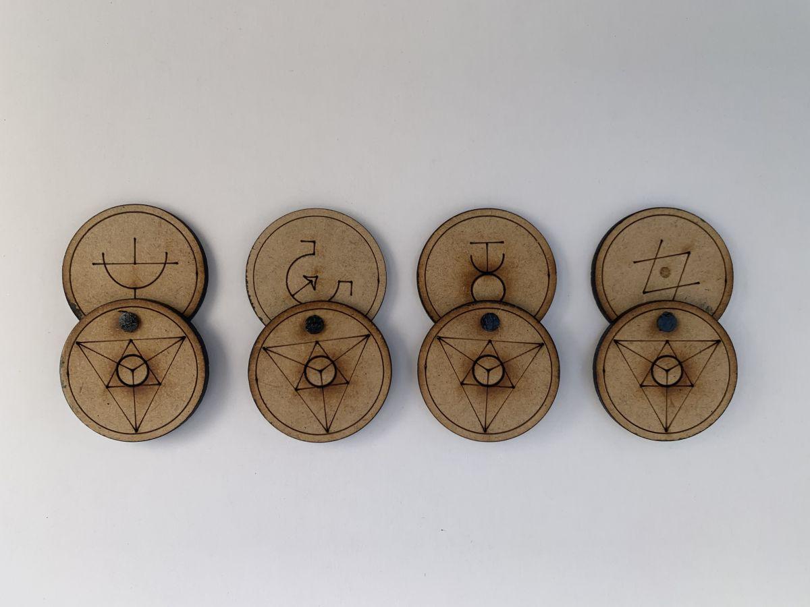
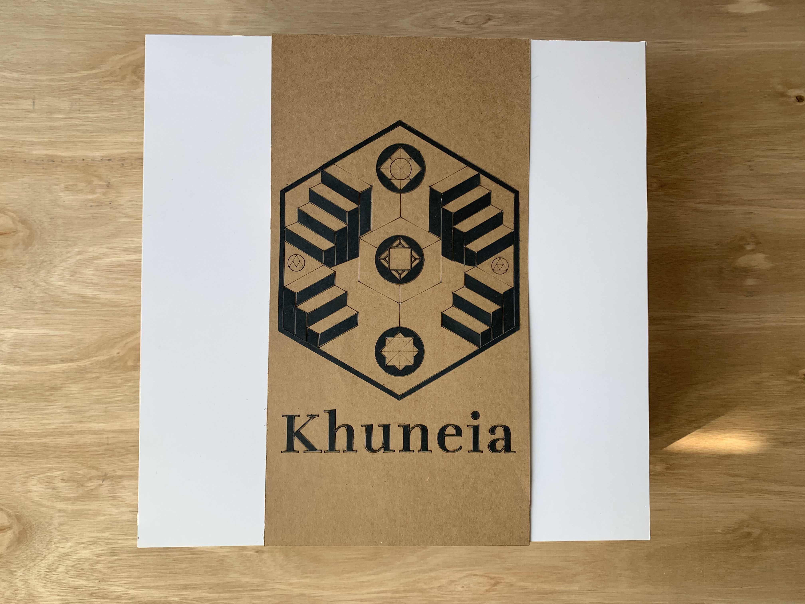

# Corte Láser

Aqui encontrarás los archivos de fabricación de corte láser

## Tablero

 

 

[estructura externa de los tableros](tablero-fichas/piezas_de_encaje_tablero.dxf)

Este archivo se cortó en mdf de 4mm

[tablero de juego](tablero-fichas/tablero%20khuneia.ai)

Este archivo se cortó y grabó en acrílico transparente de 3mm

## Fichas

 

[Fichas ocultas](tablero-fichas/fichas.ai)

Este archivo se cortó y grabó en mdf de 3mm

## Packaging

 

[Caja contenedora del juego](packaging/empaque_tablero.dxf)

Este archivo se cortó en cartón duplex blanco de 250 gramos

[Gráfica de la caja contenedora del juego](packaging/diseno-exterior-caja.ai)

Este archivo se corto y grabó en carton kraft de 200gr