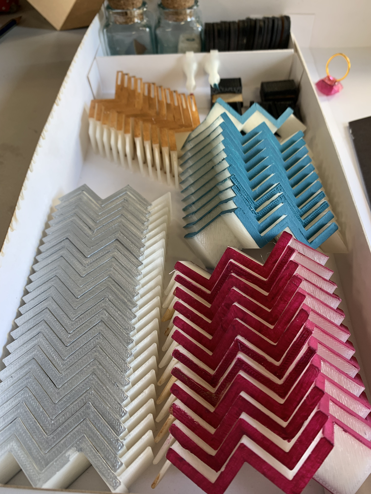

# Archivos de impresión 3d

Aquí encontrarás los archivos en formato stl para impresión 3d

 

## Escaleras

[Escalera frontal](escaleras/escalera-frontal.stl)

[Escalera 180°](escaleras/escalera180.stl)

[Escaleras laterales](escaleras/escalera-lateral.stl)

## Dados y personajes

[Dados](dados-personajes/dados.stl)

[Personajes](dados-personajes/alquimista.stl)